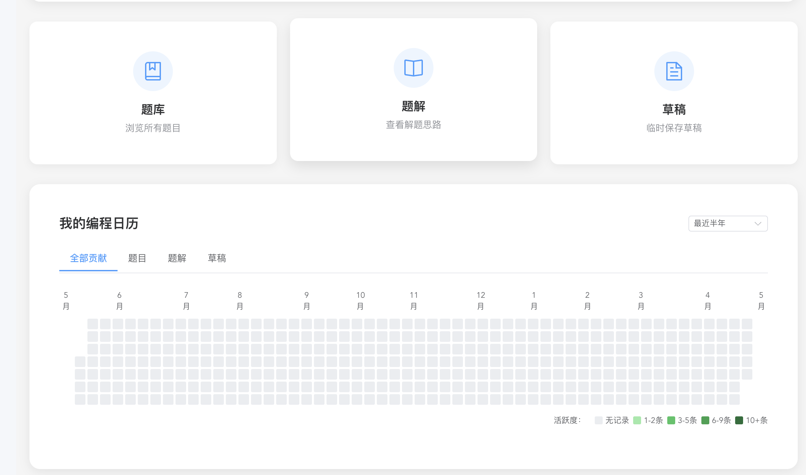
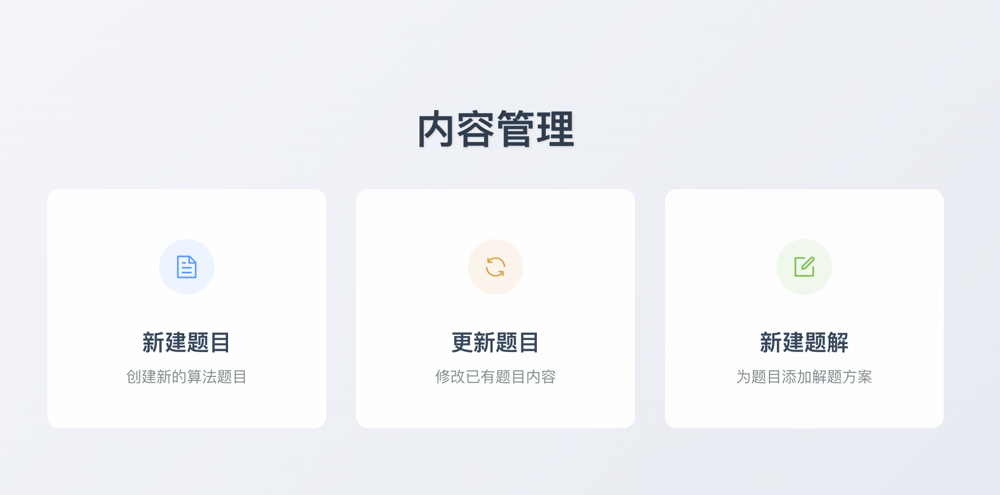
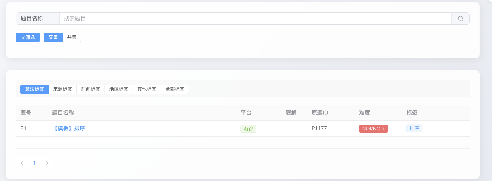
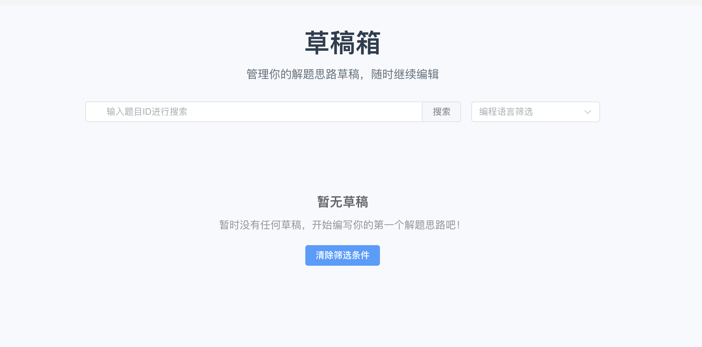
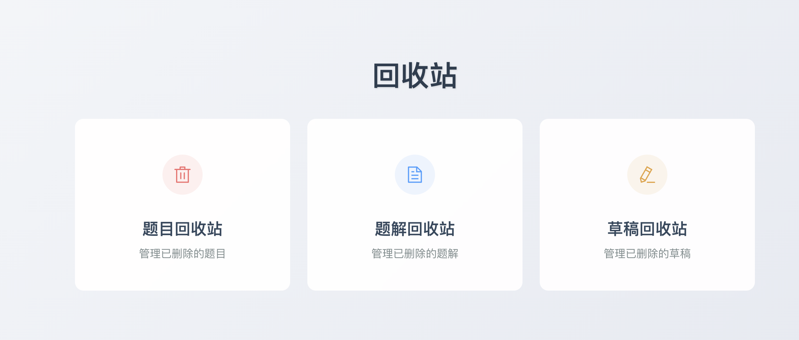

# AlgorithmWorkstation Pro 🚀

[](https://opensource.org/licenses/MIT)
[](https://vuejs.org/)
[](https://www.djangoproject.com/)
[](https://www.mysql.com/)


**智能算法题库管理平台 | LeetCode/洛谷全兼容 | 开发者的刷题助手**

## 全景预览 🔍
| 功能场景       | 效果展示                                                    | 核心交互流程               |
| -------------- | ----------------------------------------------------------- | -------------------------- |
| **主页展示**   |                                          | 链接直达/贡献热力图        |
| **内容管理**   |                                          | 新建、更新题目/新建题解    |
| **题库检索**   |                                          | 多功能筛选器自高效筛选题目 |
| **题解管理**   |  | 智能检索题解               |
| **草稿箱管理** |                                          | 智能检索临时草稿           |
| **回收站**     |                                          | 题目/题解/草稿回收站       |

## 技术架构 🏗
                    +-------------------+
                    |   Vue 3.3        |
                    |   (SPA Frontend) |
                    +--------+----------+
                             |
                    +--------+----------+
                    |   Axios          |
                    |   (HTTP Client)  |
                    +--------+----------+
                             |
                             ▼
      +------------------+        +--------------------+   
     |  Nginx 1.25       ｜ -----> |  Django 5.2        |
     |  (80/443)         |         |  (REST API)        |
     +--------+---------+          +-------+------------+
     |                       |
     ▼                       ▼
     +--------+--------+     +--------+--------+
     |  静态资源托管     |     |  Gunicorn     |
     |  (Vue打包文件)   |     |  (WSGI Server)|
     +-----------------+     +--------+--------+
     |
     ▼
     +-------+--------+
     |  MySQL 8.0     |
     |  (Data Store)  |
     +----------------+

## 功能特性 ✨
### 🚩 核心功能
- **双平台适配**：LeetCode/洛谷URL智能解析
- 题目生命周期管理：
  - 题目新建、更新
  - 题目详情页
  - 题库检索
  - 题目回收站

- **题解生命周期管理**：
  - 正式题解
  - 题解草稿更新、删除
  - 题解、草稿详情页
  - 草稿箱（临时保存未完成题解）
  - 题解、草稿回收站
- **JWT安全认证**：HttpOnly Cookie存储策略
- ⚙️Markdown编辑器（支持LaTeX公式）
- 📊贡献日历（每日刷题热力图）

## 目录架构 📂
### 前端 (algorithmFrontend)
```bash
AlgorithmWeb
├─ algorithmServer											# 后端
│  ├─ requirements.txt									
│  ├─ manage.py
│  ├─ storage 													# 文件存储
│  │  └─ luogu_tags.xlsx
│  ├─ algorithmServer
│  │  ├─ settings.py										#全局配置
│  │  ├─ urls.py												# api路由
│  └─ algorithm
│     ├─ models.py 											# 核心数据库模型
│     ├─ serializers.py 								# 核心DRF序列化器
│     ├─ apps.py
│     ├─ admin.py
│     ├─ pagination.py									# 分页器
│     ├─ views.py												# 核心视图类
│     └─ scrapers												# 爬虫功能
│        ├─ luogu.py
│        └─ leetcode.py
└─ algorithmFrontend										# 前端
   ├─ src																# 核心文件
   │  ├─ App.vue												
   │  ├─ main.js	
   │  ├─ router													# 前端路由
   │  │  └─ index.js
   │  ├─ assets													# 静态资源
   │  ├─ views													# 核心视图
   │  ├─ api														# 核心接口
   │  │  ├─ request.js									#前后端通信配置，请求、响应拦截器
   │  │  └─ ...
   │  ├─ components											# 可复用组件
   │  │  └─ AppHeader.vue								# 导航栏
   │  └─ constants
   │     └─ tags.js
   └─ public
      ├─ index.html
      └─ assets

```


## 部署方案 🚢

##### 系统需求

```bash
最小化资源要求
CPU: 2核+ 
内存: 2GB+ 
存储: 40GB+ 
```

##### 生产环境需求

|   组件   |   版本    |        备注         |
| :------: | :-------: | :-----------------: |
|  Ubuntu  | 22.04 LTS | 推荐使用systemd管理 |
|  Nginx   |   1.18+   |    配置反向代理     |
| Gunicorn |   21.2+   |     WSGI服务器      |
|  MySQL   |    8.0    |  需启用InnoDB引擎   |

## 免责声明 ⚠️

本项目包含的LeetCode/Luogu题目爬取功能仅用于**个人学习目的**，禁止用于：

- 商业性数据采集
- 干扰目标网站正常服务
- 大规模自动化请求

使用者应对自己的网络行为负责，本项目不承担因滥用爬虫功能导致的法律责任。所有功能默认以"AS IS"（现状提供）原则运行。

